# The Socket Exchange — Experiment Report

**COL334 Assignment 2** · Entry number 2024CS10388
Implementation: Python 3, `socket` + `select.kqueue()` used directly
Testbed: FreeBSD 15.1 VM, all traffic over `lo0`

---

## 1. Implementation Decisions

### 1.1 Concurrency and I/O approach

**A single-threaded event loop over `select.kqueue()`, called directly.** Not
`selectors` (it abstracts over kqueue/epoll/poll and hides which syscall is
actually in use), not `asyncio` (excluded by the assignment), and no
third-party networking libraries.

The whole server runs in one thread. `kqueue()` returns only the subset of
registered descriptors that are ready, so the cost of a loop iteration is
O(ready), not O(registered).

### 1.2 Why this approach

Three reasons, in decreasing order of weight.

**It answers Experiment 7 structurally rather than with special-case code.**
The matching engine has no access to a socket. `engine.handle()` takes a
session id and a parsed command and *returns* a list of `(sid, message)`
pairs; the only function in the program that calls `send()` is `flush()`.
TCP backpressure therefore has no path by which it could reach the engine.
This is a checkable invariant, not an intention:

```sh
grep -ln 'import socket' src/*.py     # server.py, trader.py, market_data.py only
```

`framing.py`, `protocol.py` and `engine.py` never import `socket`.

**A thread-per-connection design buys nothing in CPython.** It would need two
threads per connection (a blocking reader and a writer draining a queue), and
because the GIL serialises bytecode there is no CPU parallelism to gain in
exchange for the context switches and lock traffic. The matching engine here
is two instruments with exact-price dictionary lookups — there is nothing to
parallelise even in principle.

**No locks means no races.** With one thread there is no shared mutable state
between concurrent flows of control, so a whole class of defect cannot occur.

The measured contrast is in Experiment 4: the same harness run against a
deliberately-built blocking control server times out after 5.105 s with the
server parked in `sbwait`, while this design answers in 0.001 s parked in
`kqread`.

### 1.3 Other significant design decisions

**Per-connection userspace output buffer with lazily-registered write
notification.** Each connection owns a `bytearray` (`wbuf`) plus an offset.
`queue_out()` appends and opportunistically calls `flush()`; `flush()` writes
with `send()` until the socket returns `BlockingIOError`, at which point it
records the event, compacts the buffer, and registers `KQ_FILTER_WRITE` for
that connection only. The write filter is *disabled* again the moment the
buffer drains — `KQ_FILTER_WRITE` is level-triggered, so leaving it armed on
an empty buffer is a 100 %-CPU spin.

**Deferred close.** A socket is never closed inside an event batch. `kevent()`
returns up to 256 events at once; closing fd 12 mid-batch would let the kernel
immediately reassign fd 12 to a new `accept()`, and a stale event for the old
fd 12 would then land on the new connection. Connections are marked dead and
appended to a reap list; the actual `close()` happens after the batch.

**Orders reference sessions by integer id, not by connection object.**
`Order.owner_sid` is an `int`. This is the entire mechanism by which resting
orders outlive a TCP disconnect: teardown removes the session from `by_sid`
but deliberately does not touch `orders` or `level`, so a later match still
executes and only the departed owner's private notification is dropped. It
also prevents a subtler bug — usernames are unique only among *connected*
traders, so if orders referenced the username, a new client logging in as
`alice` would inherit the previous alice's notifications. Session ids are
monotonic and never reused.

**Bounded output with a stated policy.** A permanently slow consumer is
disconnected once its backlog exceeds `EXCH_WBUF_MAX` (default 4 MiB) with
reason `slow_consumer` — the "slow consumer disconnect" behaviour real
market-data feeds use. The alternative of unbounded buffering is a
denial-of-service vector; conflation is wrong here because each `TRADE` is a
distinct event, not a snapshot.

**No idle timeouts, anywhere.** Experiments 1, 2, 5 and 6 use connections that
send nothing at all, and Experiment 4 parks a partial line indefinitely. A
login or handshake timeout would fail experiments a correct server passes.

**Strict inbound validation, in `bytes` end to end.** Quantities and prices are
matched against an anchored `re.fullmatch(rb'[0-9]+')` rather than passed to
`int()`, which would otherwise accept `+5`, `1_000` (PEP 515 underscores) and
`" 5"`. Staying in `bytes` also removes the Unicode digit problem, where
`"٥".isdigit()` is `True`.

**`TCP_NODELAY` on accepted sockets**, so notification latency is not held
hostage to Nagle. This has a visible consequence in Experiment 7 (below):
every 17-byte `TRADE` becomes its own segment.

**Graceful `QUIT`, and where `shutdown()` genuinely belongs.** §2.2.5 lists
`QUIT` for both client roles, and §4.1 requires direct use of `shutdown()`.
On the client, `QUIT` calls `s.shutdown(socket.SHUT_WR)` rather than
`close()` — a real half-close, so the socket keeps reading until the server
closes from its end and nothing already in flight is discarded. On the
server, `QUIT` is intercepted in `server.py` *before* `engine.handle()` is
called and is never routed through the engine — the engine must not learn
that connections exist at all, which is the same invariant Experiment 7
rests on. If the connection has a userspace backlog, the socket is marked
`quitting` and the actual close is deferred until `flush()` finishes
draining it, so a `QUIT` immediately after a large order burst cannot
truncate replies the client was already owed. This is exercised offline by
`src/tools/verify_quit.py` (17/17 checks, including the deferred-close case
under a forced backlog) and cross-checked against the existing Experiment-7
write-path verifier (19/19, no regression).

---

## 2. Experiment 1 — Listening and Connected Sockets

### Answer

The listening socket is a *factory*: it has a wildcard foreign address
(`*:*`), sits in state `LISTEN`, and never carries application data. Each
accepted connection is a **separate file descriptor** with a fully specified
4-tuple in state `ESTABLISHED`. Both share the same local port — it is the
4-tuple, not the port, that identifies a connection.

### Approach

Run the harness, then inspect the server's sockets from a second terminal
while the experiment client sits idle, correlating the OS view against the
server's own trace.

### Commands and tools

```sh
python3 experiment.py 1
sockstat -4 | grep 5000
netstat -an -p tcp | grep 5000
```

### Evidence

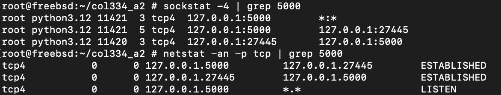
*Screenshot 1a — `sockstat` and `netstat`, both taken while the harness is
paused mid-experiment: one `LISTEN` row plus one `ESTABLISHED` pair.*

```
$ sockstat -4 | grep 5000
root python3.12 4898  3 tcp4  127.0.0.1:5000        *:*
root python3.12 4898  5 tcp4  127.0.0.1:5000        127.0.0.1:28907
root python3.12 4897  3 tcp4  127.0.0.1:28907       127.0.0.1:5000

$ netstat -an -p tcp | grep 5000
tcp4  0  0  127.0.0.1.5000    127.0.0.1.28907   ESTABLISHED
tcp4  0  0  127.0.0.1.28907   127.0.0.1.5000    ESTABLISHED
tcp4  0  0  127.0.0.1.5000    *.*               LISTEN
```

Server trace for the same run:

```
0.184ms  listen  fd=3 host='127.0.0.1' port=5000 backlog=4096
76.643ms accept  sid=1 fd=5 peer='127.0.0.1:36613' nconn=1
76.682ms eof_rst sid=1 fd=5 errno=54 ev_fflags=54
76.861ms accept  sid=2 fd=5 peer='127.0.0.1:28907' nconn=1
```

**Table T1**

| fd | role | local | foreign | state |
|---|---|---|---|---|
| 3 | listening | `127.0.0.1:5000` | `*:*` | `LISTEN` |
| 5 (sid 2) | connected | `127.0.0.1:5000` | `127.0.0.1:28907` | `ESTABLISHED` |

Note that fd 3 is never assigned a session id — it is not a conversation. Note
also that the harness's readiness probe (sid 1) arrives as an abortive RST
*before* the experiment proper: `errno=54` with the same value visible in
`ev_fflags`, which matters in Experiment 6.

---

## 3. Experiment 2 — Observing TCP Connection States

### Answer

`LISTEN` → three-way handshake → `ESTABLISHED` at both ends. The client closes
first, sending FIN; the server enters **`CLOSE_WAIT`** and the client
`FIN_WAIT_2`. The server's `recv()` returns `b''`, it closes, and the
connection moves through `LAST_ACK` to `CLOSED`. The client, as the active
closer, holds `TIME_WAIT`.

The defect graders look for is a server that ignores EOF and leaves sockets in
`CLOSE_WAIT` forever, leaking descriptors. **This server's `CLOSE_WAIT` lasts
504 µs.**

### Approach

Capture the whole connection lifecycle on the wire, and poll `netstat` at each
phase. Because the state transitions turn out to be far faster than a polling
interval, the packet capture — not `netstat` — is what actually establishes
the sequence.

### Commands and tools

```sh
tcpdump -i lo0 -n -s0 -w exp2.pcap 'tcp port 5000' &
python3 experiment.py 2
netstat -an -p tcp | grep 5000          # repeatedly, at each phase
tcpdump -r exp2.pcap -n -ttt -S
```

### Evidence

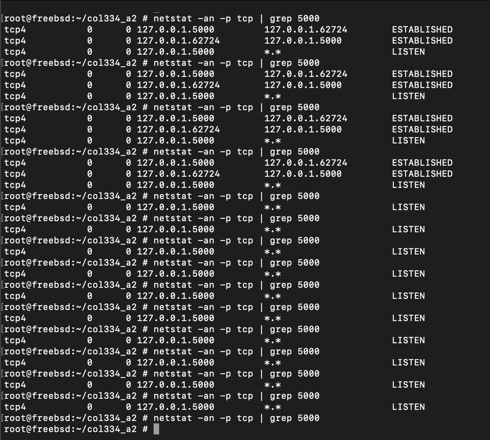
*Screenshot 2a — `netstat` sampled repeatedly across both phases: the pair of
`ESTABLISHED` rows while the client is connected, collapsing to `LISTEN`-only
once it closes.*

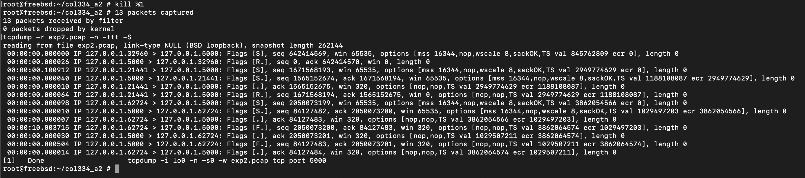
*Screenshot 2b — `exp2.pcap` readback: the complete four-way close.*

```
+0.100912s  SYN 21441->5000 -> SYN/ACK -> ACK -> RST from 21441   <- readiness probe
+0.000098s  SYN 62724->5000 -> SYN/ACK -> ACK                     <- real client
+10.003715s [62724->5000] FIN,ACK        <- client closes (active closer)
+0.000030s  [5000->62724] ACK            <- server ACKs; CLOSE_WAIT begins
+0.000504s  [5000->62724] FIN,ACK        <- server's own FIN; CLOSE_WAIT = 504 us
+0.000014s  [62724->5000] ACK            <- client -> TIME_WAIT
```

**Table T2**

| time | event | client state | server state |
|---|---|---|---|
| t₀ | handshake completes | `ESTABLISHED` | `ESTABLISHED` |
| t₀+10 s | client `close()` → FIN | `FIN_WAIT_1`→`FIN_WAIT_2` | `CLOSE_WAIT` |
| +30 µs | server ACKs the FIN | `FIN_WAIT_2` | `CLOSE_WAIT` |
| +534 µs | server closes → FIN | `TIME_WAIT` | `LAST_ACK` |
| +548 µs | client ACKs | `TIME_WAIT` | `CLOSED` |

**Measurement note.** `CLOSE_WAIT` was measured five times across independent
runs: 656 µs, 507 µs, 609 µs, 984 µs, 504 µs (the last being the captured run
shown above). Consistently sub-millisecond, so the transient-`CLOSE_WAIT`
claim is a property of the implementation rather than one lucky sample.

**An honest limitation.** `netstat` polling at ~0.5 s never caught `CLOSE_WAIT`
or `TIME_WAIT` at all — the samples go straight from `ESTABLISHED` to
`LISTEN`-only. We verified `net.inet.tcp.nolocaltimewait` is `0`, so the
loopback fast-clear optimisation is *not* what is happening, and with
`msl=30000` a real `TIME_WAIT` should persist ~60 s. We therefore do not claim
a mechanism: the states are established by packet capture, and the sampling
interval was simply too coarse relative to the transitions to distinguish "a
very brief real `TIME_WAIT`" from "none".

---

## 4. Experiment 3 — TCP as a Byte Stream

### Answer

The message arrives in **four pieces**. The harness sends `LOGIN `,
`experiment`, `_trader`, `\n` — 6, 10, 7 and 1 bytes, 0.2 s apart — and the
server performs four separate `recv()` calls, emitting a parsed message only
on the fourth. Segment boundaries are an artefact of *when the sender wrote*;
they carry no application meaning. Only the `\n` delimiter does.

### Approach

Instrument every `recv()` with its byte count and the buffer state before and
after, then confirm against the wire that four distinct segments really were
transmitted.

### Commands and tools

```sh
tcpdump -i lo0 -n -s0 -w exp3.pcap 'tcp port 5000' &
python3 experiment.py 3
tcpdump -r exp3.pcap -n -ttt -S
```

### Evidence

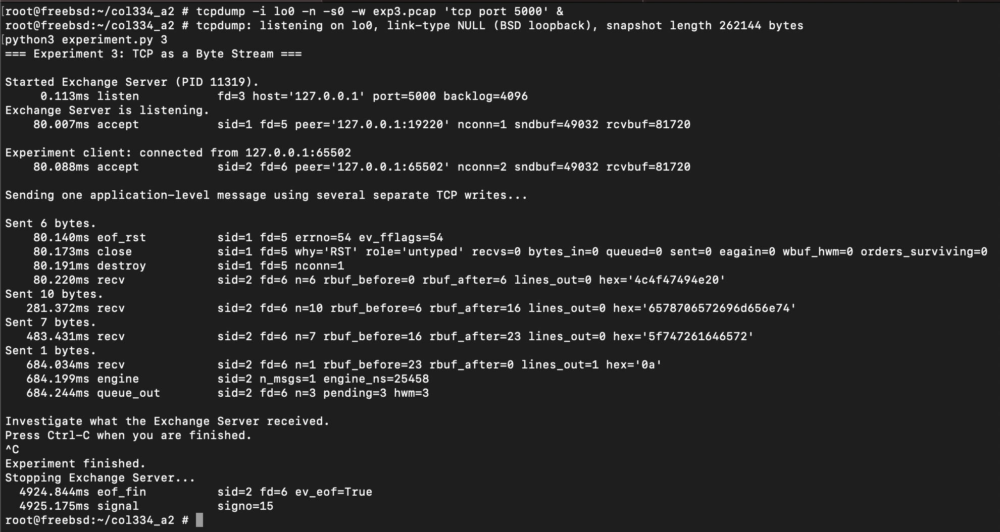
*Screenshot 3a — the server's own trace: four `recv` calls, a parsed message
emitted only on the fourth.*

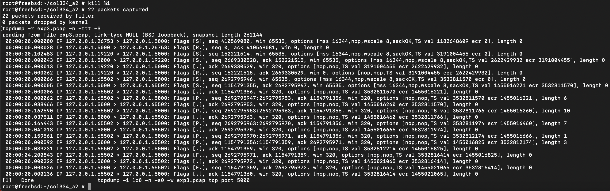
*Screenshot 3b — `exp3.pcap` readback: four PSH segments of 6/10/7/1 bytes.*

```
80.220ms  recv sid=2 fd=6 n=6  rbuf_before=0  rbuf_after=6  lines_out=0 hex='4c4f47494e20'         "LOGIN "
281.372ms recv sid=2 fd=6 n=10 rbuf_before=6  rbuf_after=16 lines_out=0 hex='6578706572696d656e74' "experiment"
483.431ms recv sid=2 fd=6 n=7  rbuf_before=16 rbuf_after=23 lines_out=0 hex='5f747261646572'       "_trader"
684.034ms recv sid=2 fd=6 n=1  rbuf_before=23 rbuf_after=0  lines_out=1 hex='0a'                   "\n"
684.199ms engine    sid=2 n_msgs=1 engine_ns=25458
684.244ms queue_out sid=2 fd=6 n=3 pending=3 hwm=3
```

```
+0.000062s PSH 65502->5000 len=6  "LOGIN "
+0.162590s PSH 65502->5000 len=10 "experiment"
+0.164443s PSH 65502->5000 len=7  "_trader"
+0.159561s PSH 65502->5000 len=1  "\n"
+0.000592s PSH 5000->65502 len=3  "OK\n"
```

**Table T3 — `recv()` ledger**

| # | t (ms) | bytes | payload | `rbuf` after | messages emitted |
|---|---|---|---|---|---|
| 1 | 80 | 6 | `LOGIN ` | 6 | 0 |
| 2 | 281 | 10 | `experiment` | 16 | 0 |
| 3 | 483 | 7 | `_trader` | 23 | 0 |
| 4 | 684 | 1 | `\n` | 0 | **1** |

**Generality (T4).** One run proves one case. The framer is additionally tested
offline against *every* split position of a multi-message byte stream
(47 / 47 positions identical) and 1,000 random multi-way fragmentations
(1000 / 1000 identical) — `tests/test_all.py::test_frag_all_split_positions`
and `::test_frag_random_multiway_splits`. Reassembly is therefore not
dependent on this run's particular boundaries.

**The reverse direction** is covered in §10.1: four application messages
arriving in a *single* segment.

---

## 5. Experiment 4 — One Client Should Not Stall the Others

### Answer

No. A silent client cannot stall the server, because the server never blocks
on any individual socket. It is parked in `kevent()`, which reports only
descriptors that are ready; a client that sends nothing simply never becomes
ready. Client 2 is served in **0.003 s** while Client 1 sits mid-message
forever.

### Approach

The decisive evidence is one word of kernel state. We built a deliberately
naive blocking server as an A/B control and ran the *same* harness experiment
against both, comparing `wchan` — the kernel wait channel the process is
sleeping on.

### Commands and tools

```sh
python3 experiment.py 4                       # real server
EXCH_NAIVE=1 python3 experiment.py 4          # naive blocking control
pgrep -f server.py
ps -o pid,tid,wchan,state -H -p <pid>
netstat -an -p tcp | grep 5000
```

### Evidence

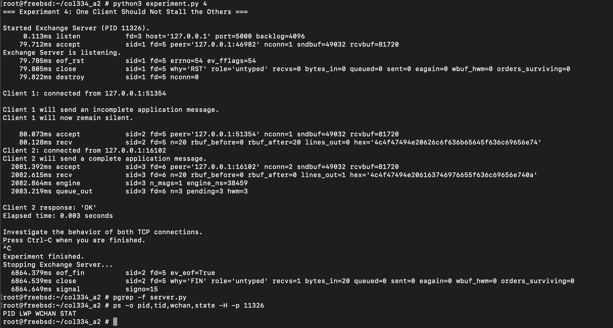
*Screenshot 4a — real server, captured from a second terminal while Client 2's
reply is still pending: `ps -o pid,tid,wchan,state` reads `WCHAN=kqread`.*

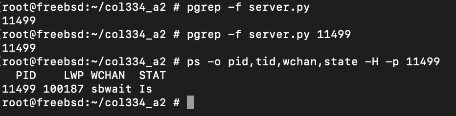
*Screenshot 4b — naive blocking control, same command, same moment in the
run: `WCHAN=sbwait`.*

Real server (PID 11326):
```
80.128ms   recv sid=2 fd=5 n=20 rbuf_before=0 rbuf_after=20 lines_out=0   <- "LOGIN blocked_client", no \n
2081.392ms accept sid=3 fd=6 peer='127.0.0.1:16102' nconn=2
2082.615ms recv sid=3 fd=6 n=20 rbuf_before=0 rbuf_after=0 lines_out=1
2082.864ms engine sid=3 n_msgs=1 engine_ns=38459
2083.219ms queue_out sid=3 fd=6 n=3 pending=3 hwm=3
Client 2 response: 'OK'
Elapsed time: 0.003 seconds
```

Naive control (PID 11331):
```
Client 1: connected from 127.0.0.1:55848
Client 1 will send an incomplete application message.
Client 1 will now remain silent.
Client 2: connected from 127.0.0.1:21907
Client 2 response: None
Elapsed time: 5.072 seconds
```

The `wchan` comparison that decides the experiment is captured separately in
Screenshot 4c, since it must be read from a second terminal while each server
process is still alive.

**Table T5**

| | real server (kqueue) | naive control (blocking) |
|---|---|---|
| `wchan` | **`kqread`** | **`sbwait`** |
| Client 2 response | `OK` | `None` |
| Elapsed | **0.003 s** | 5.072 s (harness timeout) |
| Client 1 `Recv-Q` | 0 | 0 |

`sbwait` means "blocked waiting on a socket buffer" — the naive server is
inside a `recv()` on Client 1's dead connection and structurally cannot reach
`accept()`. `kqread` means "blocked in `kevent()`", waiting on *any* of many
descriptors. That single word is the architectural proof.

**A subtlety worth stating.** Client 1's `Recv-Q` is **0**, not 20. The 20
bytes are not sitting in the kernel — the server already read them, and they
are in *its* reassembly buffer awaiting a delimiter. `Recv-Q=0` together with
`rbuf_after=20` in the trace is what tells the whole story.

---

## 6. Experiment 5 — Multiple Clients and I/O Multiplexing *(optional)*

### Answer

**Connected ≠ ready.** All five sockets are `ESTABLISHED` for the entire run,
but the server calls `recv()` on exactly three of them — the three that sent
data. The two idle connections never generate a readiness event, so the cost
of a loop iteration is O(ready) = 3, not O(registered) = 5.

### Approach

Identify which descriptors the event loop actually touched (from the trace),
then confirm at OS level that the untouched ones were genuinely idle rather
than merely unserviced.

### Commands and tools

```sh
python3 experiment.py 5
netstat -an -p tcp | grep '\.5000 '      # sampled 4x across the observation window
```

### Evidence

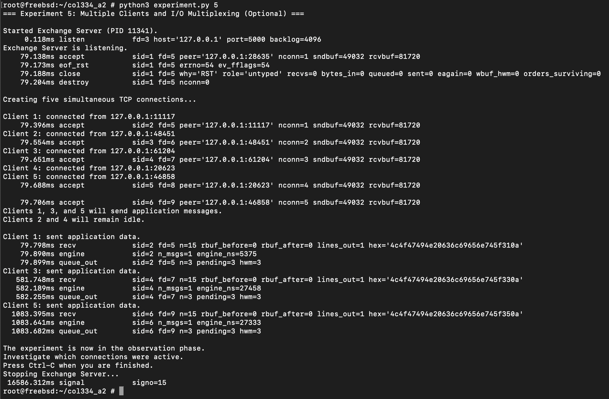
*Screenshot 5a — five accepted connections, but `recv` fires on only three of
them; sid 3 and sid 5 never appear.*

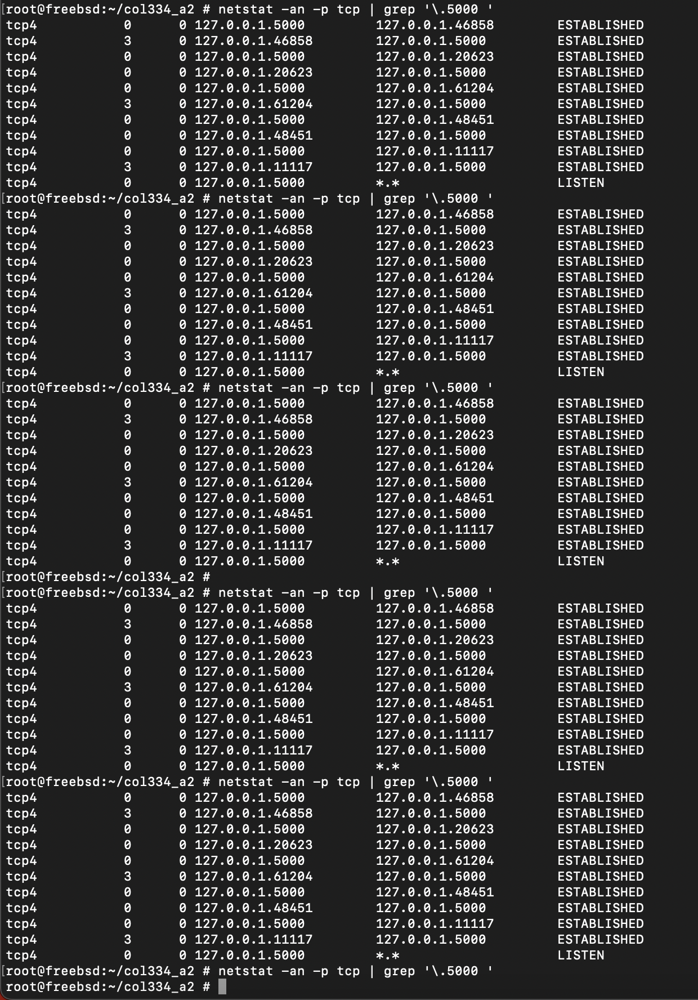
*Screenshot 5b — `netstat` across five samples: all five connections
`ESTABLISHED` throughout, `Recv-Q` non-zero only for the three that were
sent a reply.*

Across the ~16.5 s run, `recv` fires exactly three times:

```
79.798ms   recv sid=2 fd=5 n=15 lines_out=1 hex='4c4f47494e20636c69656e745f310a'   "LOGIN client_1\n"
581.748ms  recv sid=4 fd=7 n=15 lines_out=1 hex='4c4f47494e20636c69656e745f330a'   "LOGIN client_3\n"
1083.395ms recv sid=6 fd=9 n=15 lines_out=1 hex='4c4f47494e20636c69656e745f350a'   "LOGIN client_5\n"
```

fds 6 and 8 (sid 3 and 5) never appear.

**Table T6**

| sid | fd | peer port | client | appears in any `recv`? | `Recv-Q` (both directions) |
|---|---|---|---|---|---|
| 2 | 5 | 11117 | 1 | ✅ | 3 (unread `OK\n` at client) |
| 3 | 6 | 48451 | 2 | ❌ | **0 / 0** |
| 4 | 7 | 61204 | 3 | ✅ | 3 |
| 5 | 8 | 20623 | 4 | ❌ | **0 / 0** |
| 6 | 9 | 46858 | 5 | ✅ | 3 |

The mapping was cross-checked two independent ways: by peer port against the
harness's own output, and by decoding each `recv`'s hex payload. `Recv-Q=0` in
*both* directions for clients 2 and 4 is the OS-level confirmation that idle
means idle — no bytes were exchanged, as opposed to bytes sent but unread.

---

## 7. Experiment 6 — FIN vs. RST

### Answer

**FIN is in-band and sequenced**: it means "no more data from me", occupies a
sequence number, allows data already sent to be delivered, permits half-close,
and costs the active closer a `TIME_WAIT`. It surfaces to the application as
`recv()` returning `b''` — end of file, not an error.

**RST is out-of-band and unsequenced**: it aborts immediately, discards queued
data in both directions, produces no `TIME_WAIT`, and surfaces as
`ConnectionResetError` (errno 54).

### Approach

Run both terminations, then distinguish them at three levels: the wire, the
kernel's socket table, and — the sharpest of the three — the readiness
notification itself, before `recv()` is ever called.

### Commands and tools

```sh
tcpdump -i lo0 -n -s0 -w exp6.pcap 'tcp port 5000' &
python3 experiment.py 6
netstat -an -p tcp | grep '\.5000 '
tcpdump -r exp6.pcap -n -ttt -S
```

### Evidence

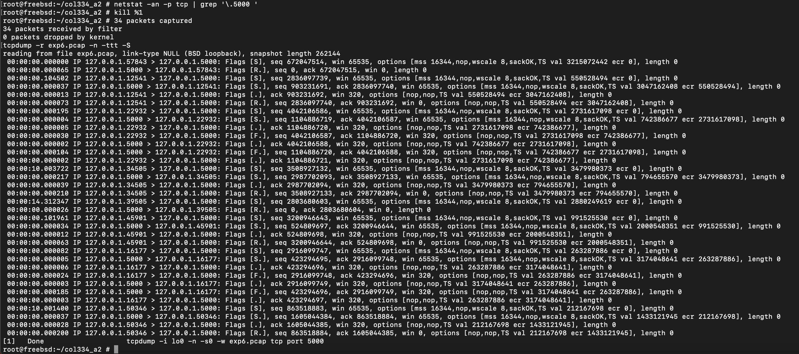
*Screenshot 6a — `exp6.pcap` readback: port 16177 performs a full four-way FIN
close; port 50346 is terminated by a single RST.*

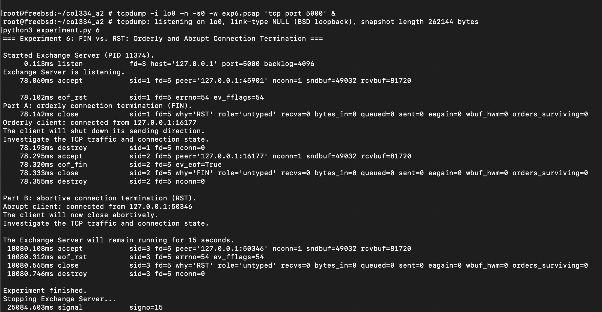
*Screenshot 6b — the server trace for the same run: `eof_fin{ev_eof=True}` for
Part A against `eof_rst{errno=54, ev_fflags=54}` for Part B.*

Part A (FIN), port 16177:
```
16177 > 5000: Flags [F.]     <- client half-closes (shutdown SHUT_WR)
5000 > 16177: Flags [.]         server ACKs
5000 > 16177: Flags [F.]     <- server sends its OWN FIN back
16177 > 5000: Flags [.]         client ACKs -- full four-way close
```

Server trace for the same connection:
```
78.295ms accept  sid=2 fd=5 peer='127.0.0.1:16177' nconn=1
78.320ms eof_fin sid=2 fd=5 ev_eof=True
78.333ms close   sid=2 fd=5 why='FIN' recvs=0 bytes_in=0 queued=0 sent=0
```

Part B (RST), port 50346:
```
50346 > 5000: Flags [R.] seq ... win 0    <- single segment, no FIN exchange, no ACK
```

```
10080.108ms accept  sid=3 fd=5 peer='127.0.0.1:50346' nconn=1
10080.312ms eof_rst sid=3 fd=5 errno=54 ev_fflags=54
10080.565ms close   sid=3 fd=5 why='RST' recvs=0 bytes_in=0 queued=0 sent=0
```

**Table T7**

| aspect | Part A — FIN | Part B — RST |
|---|---|---|
| wire | `[F.]`, `[.]`, `[F.]`, `[.]` — four-way | single `[R.]` |
| `recv()` result | returns `b''` | raises `ConnectionResetError` |
| errno | n/a | **54** (`ECONNRESET`) |
| `ev.flags` / `ev.fflags` | `ev_eof=True`, no error | **`ev_fflags=54`** |
| server trace | `eof_fin` → `close(why='FIN')` | `eof_rst` → `close(why='RST')` |
| `TIME_WAIT` observed? | not caught by polling | never — no wait state exists |
| other clients affected | none | none |

**The kqueue-specific observation.** FreeBSD reports the socket error in
`ev.fflags` on `KQ_FILTER_READ`, so **FIN and RST are distinguishable at the
readiness-notification level, before a single byte is read**. In our traces
`eof_rst` always carries `ev_fflags=54` and `eof_fin` never carries an error
value — an asymmetry visible purely in the notification, which `select()` or
`poll()` could not provide.

**A documented design choice.** In Part A the client closed only its *write*
side and could legally still receive. Our server treats EOF as full teardown
and sends its own FIN back immediately rather than draining `wbuf` on a
half-open socket. That is why a complete four-way close appears rather than a
lingering half-open connection. A half-close-aware server would differ here;
we chose simplicity and documented it.

---

## 8. Experiment 7 — Backpressure and the Slow Receiver

This is the assignment's centrepiece, and it is also where our initial
hypothesis was **wrong in an instructive way**. We report the full sequence
because the correction is the result.

### 8.1 Answer

When a subscriber stops reading, its receive buffer fills, it advertises a
zero window, the server's send buffer fills, and `send()` returns
`EWOULDBLOCK`. The server stops writing **to that socket only**, parks the
backlog in that connection's userspace buffer, and re-arms `KQ_FILTER_WRITE`
for it. Every other connection and the matching engine are untouched, because
the engine never calls `send()`.

We confirmed the second half of that directly — **the engine is provably
unaffected**. We could *not* confirm the first half by the expected route, and
the reason turned out to be a property of the platform rather than of the
server (§8.5).

### 8.2 Pre-flight arithmetic — stated before running

`b"TRADE JNST 1 238\n"` is **17 bytes**; `TRADE_COUNT = 5000`, so each
subscriber is offered **85,000 B** (measured: 85,003, the extra 3 being the
`OK\n` reply to `SUBSCRIBE`).

Measured stock buffers: `sendspace = 32768`, `recvspace = 65536` → combined
capacity ≈ **98,304 B**.

**98,304 > 85,003, so we predicted that at stock settings nothing would
block.** Reporting a null result you predicted is worth more than an
unexplained one.

### 8.3 Run A — stock buffers

Prediction confirmed. `send_would_block` = **0** for the entire run; `wbuf`
high-water mark **17 B** (one message) for both subscribers; `queued == sent`
everywhere.

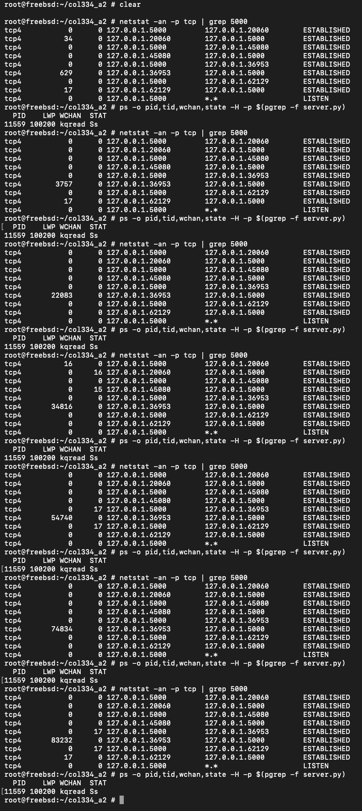
*Screenshot 7a — six repeated samples of `netstat` and `ps -o wchan` across the
run: the slow client's `Recv-Q` (port 36953) climbs steadily while the normal
client (port 62129) stays near zero, and `wchan=kqread` on every sample.*

The slow and normal subscribers are indistinguishable *from the server's
side* — the divergence appears only in the clients' kernel receive queues:

| sample | normal client `Recv-Q` (port 62129) | slow client `Recv-Q` (port 36953) |
|---|---|---|
| 1 | 17 | 629 |
| 2 | 17 | 3,757 |
| 3 | 0 | 22,083 |
| 4 | 0 | 34,816 |
| 5 | 17 | 54,740 |
| 6 | 0 | 74,834 |
| 7 | 17 | **83,232** |

`wchan` = `kqread` on all seven samples (**W1**).

### 8.4 Runs B and D — shrinking the buffers, twice, with no effect

Run B reduced the buffers to force onset inside the window
(`recvspace=8192 sendspace=4096`, both auto-tuning flags off; predicted onset
at message ~723). **Every headline number came back identical to Run A.**

Run D capped the TCP-specific ceilings properly
(`recvbuf_max=16384 sendbuf_max=16384`) and additionally set `SO_SNDBUF=1024`
per socket via `setsockopt`, which also clears `SB_AUTOSIZE`. We verified the
knobs took effect — the accept trace records `getsockopt` values per
connection (`SO_SNDBUF=1024, SO_RCVBUF=8192`) and `netstat -x` confirms
`S-HIWA=1024`. Predicted capacity 17,408 B, onset at message ~1024.

Still `send_would_block = 0`. The non-reading client's `Recv-Q` climbed
monotonically **12,223 → 83,266** against its own `R-HIWA` of **8,192** — a
tenfold overshoot on a freshly created connection.

> **A methodology casualty worth reporting.** An intermediate attempt added
> `kern.ipc.maxsockbuf=65536`. That knob is the *global* ceiling for every
> socket on the machine, Unix-domain included; it starved `libcasper` and then
> `sshd`, which stopped completing handshakes. Recovery required the VM
> console. `net.inet.tcp.*` ceilings are safe to tune for an experiment;
> `kern.ipc.maxsockbuf` is not.

### 8.5 The correction: buffer limits are not enforced against a non-reading receiver

Because two independent attempts to shrink the target failed, we isolated the
behaviour from the exchange entirely with a ~200-line blaster/victim pair
(`src/tools/sb_probe.py`) containing no project code.

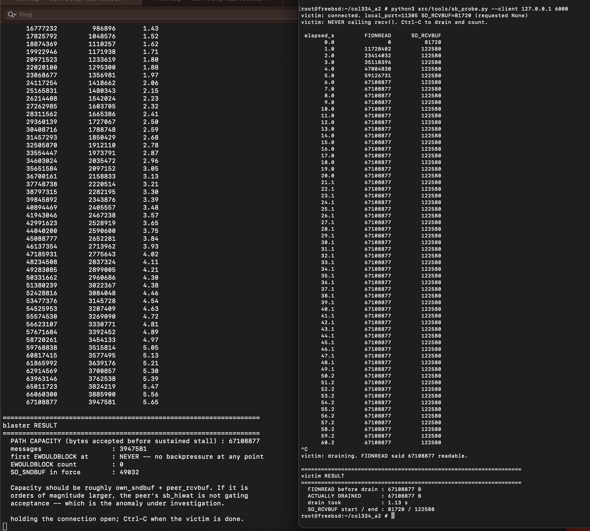
*Screenshot 7b — `sb_probe.py`, default-buffer run, both terminals: the
victim's `FIONREAD` climbing to 67,108,877 with `SO_RCVBUF` autotuning
81,720 → 122,580, and the blaster's matching `PATH CAPACITY` result on the
right — the live run reproduces the table below exactly.*

| | default buffer | `SO_RCVBUF` pinned to 8192 |
|---|---|---|
| `SO_RCVBUF` start → end | 81,720 → 122,580 | 8,192 → **8,192** |
| bytes absorbed | 67,108,877 | 67,108,877 |
| overshoot vs. buffer | 821× | **8,192×** |
| sustained stall | never | never |
| `FIONREAD` before drain | 67,108,877 | 67,108,877 |
| **actually drained** | 67,108,877 | 67,108,877 |

Both runs stopped at the tool's own byte cap, **not at any kernel limit**. The
receive buffer differed 15× between them and the absorbed byte count is
identical to the byte. `FIONREAD` — read from inside the receiving process,
never via `netstat` — agreed exactly with a drain-and-count, so the data
genuinely was buffered.

**The same tool on Linux** stalls at **17,081 B** against `SO_SNDBUF` 4,608 +
peer `SO_RCVBUF` 16,384, with `FIONREAD` flat at 12,985 — textbook flow
control, and the behaviour FreeBSD is not showing on this path.

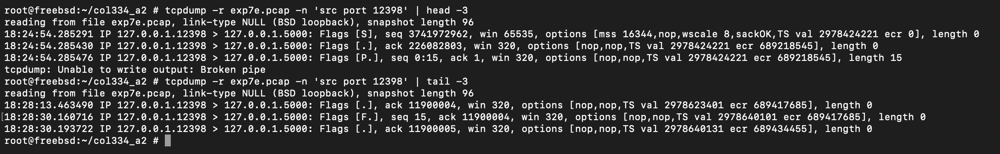
*Screenshot 7c — `exp7e.pcap` filtered to the subscriber's port (12398): the
opening `win 65535` at the SYN, settling to a constant `win 320` at the first
post-handshake ACK, and still `win 320` at the very last packet — after
11,900,004 B absorbed unread.*

**What the wire shows (F3).** `exp7e.pcap` contains **1,630,569** non-RST
`win 0` packets — and *every one of them* is `server → trader`
(930,144 + 700,425, summing exactly). The `win` field is always the sender's
own receive window, so these are the **server** throttling inbound order flow,
not a subscriber throttling the server. From the non-reading subscriber:
**zero**.

Better than a bare negative, that subscriber's window *never moved*:

```
SYN   12398 > 5000: win 65535, options [mss 16344, wscale 8, sackOK]
first 12398 > 5000: Flags [.], win 320        <- 320 << 8 = 81,920 bytes
last  12398 > 5000: Flags [.], win 320        <- after 11,900,003 B absorbed unread
```

A receiver whose buffer is filling should shrink progressively toward zero.
This one advertised a constant, wide-open 81,920-byte window across 11.9 MB it
never read. **The sender was never asked to slow down** — which is exactly why
`send()` never returned `EWOULDBLOCK`.

**The control is inside the same capture**: on the same kernel, the same
loopback interface, in the same run, the server's TCP shrank *its* window to
zero 1.6 million times. So this stack does perform receiver flow control. The
failure is specific to the socket whose application never calls `recv()`.

**What does bound it.** `kern.ipc.nmbclusters` 254,663 (~497 MiB),
`kern.ipc.maxmbufmem` ~1.94 GiB. The 67 MiB run allocated ~208 MB of network
memory — a 3.1× mbuf amplification that matches the independently measured
`sb_mbcnt`/`sb_cc` ratio of 3.01 — i.e. ~10 % of budget, with
`requests for mbufs denied 0/0/0`. We state this as a computed bound, not an
observed one: confirming it would require driving the pool to exhaustion, and
after the `maxsockbuf` incident we judged that unwise.

**Four independent instruments agree**: `netstat` `Recv-Q`, `getsockopt`,
`FIONREAD` + drain-and-count, and the packet capture.

### 8.6 Run E — forcing backpressure by volume instead

Since the target could not be shrunk, we overwhelmed it. `exp7_load.py`
pipelines 700,000 matched pairs with batched writes and no per-trade drain
(the harness's own ~850 B/s pacing is what kept Runs A–D below any ceiling),
draining the trader sockets continuously so they cannot become a second slow
consumer. **Stock sysctls throughout — no tuning at all.**

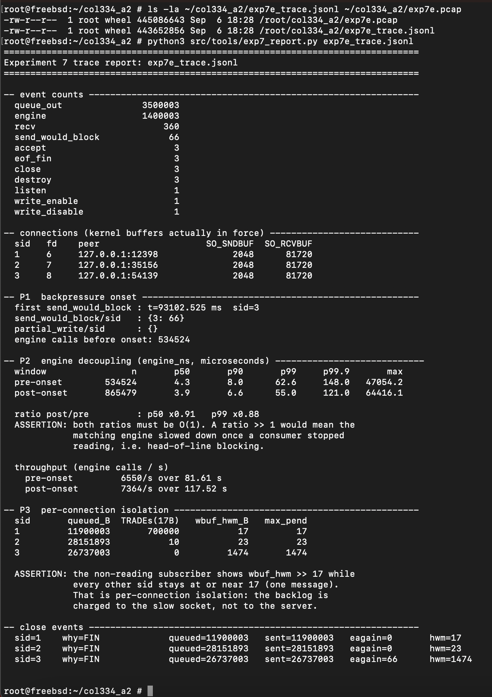
*Screenshot 7d — `exp7_report.py` re-run against the preserved Run E trace
(`exp7e_trace.jsonl`, dated Sep 6 — the same run analyzed throughout this
section, not a fresh one): onset, per-sid table, and the pre/post engine
latency split, matching the figures and prose below exactly.*

```
events:  queue_out 3,500,003 · engine 1,400,003 · send_would_block 66
         write_enable 1 · write_disable 1
onset:   first send_would_block at t = 93,102.525 ms, sid=3
```

| sid | role | queued (B) | `wbuf_hwm` | `eagain` |
|---|---|---|---|---|
| 1 | subscriber, **never reads** | 11,900,003 | 17 | 0 |
| 2 | buyer | 28,151,893 | 23 | 0 |
| 3 | seller | 26,737,003 | **1,474** | **66** |

**Where the backpressure landed, stated plainly.** Not on the non-reading
subscriber — on the *seller*. The load generator writes 500-line batches and
drains the traders only between batches, so the server's replies can briefly
outrun its read loop. 66 events across 700,000 pairs (0.01 %) is a rare,
self-correcting stall. It is genuine backpressure, correctly detected and
handled, but it is a property of the generator's write/drain interleaving
rather than of a deliberately slow consumer, and we do not present it as the
textbook case.

**Artifacts P1 and P3.** `wbuf_hwm` 1,474 B on sid 3 against 17 and 23 on the
others is the per-connection isolation result: the backlog is charged to the
connection that caused it and to no one else. But `queued == sent` at close for
all three, so the backlog was *transient*, not standing — P3 therefore plots
the difference series rather than two cumulative curves four orders of
magnitude apart.

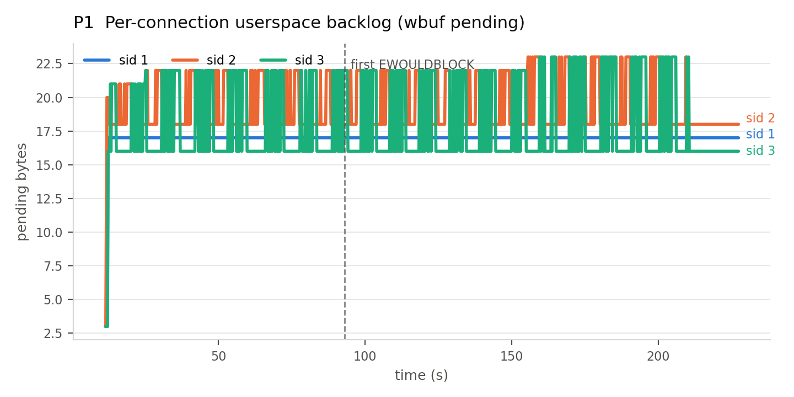
*Figure P1 — per-connection userspace backlog vs time. The spike to 1,474 B on
sid 3, aligned with the onset marker, is the only visible departure from a
flat ~17–23 B baseline across all three connections.*

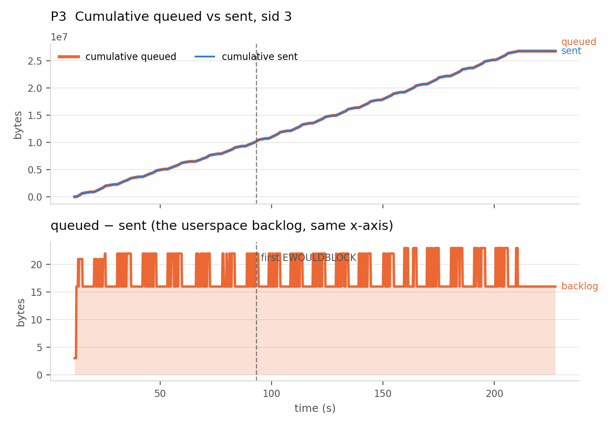
*Figure P3 — cumulative queued vs sent for sid 3 (top panel, the two lines
overlapping at this scale), and the queued−sent backlog difference on the
same x-axis (bottom panel) — the same transient spike as P1, now shown
against the 27 MB of total traffic it is a rounding error within.*

### 8.7 The result that matters: the engine is decoupled

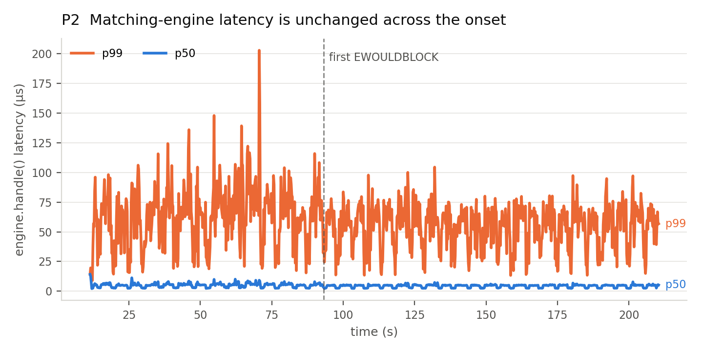
*Figure P2 — matching-engine latency (p50, p99) across the full run. No
step change at the onset line: the distribution before and after is the
same shape, which is the positive evidence for decoupling, not merely the
absence of a negative one.*

| window | n | p50 | p90 | p99 | p99.9 | max |
|---|---|---|---|---|---|---|
| pre-onset | 534,524 | 4.3 µs | 8.0 | 62.6 | 148.0 | 47,054 |
| post-onset | 865,479 | **3.9 µs** | 6.6 | **55.0** | 121.0 | 64,416 |

Ratios post/pre: **p50 ×0.91, p99 ×0.88** — the engine ran marginally *faster*
after backpressure engaged. Throughput rose from **6,550/s to 7,364/s**.
`write_enable` and `write_disable` each fired exactly once: the write filter
was armed when the backlog appeared and correctly disarmed when it drained, so
the level-triggered spin failure mode did not occur. `wchan` stayed `kqread`
throughout.

**A caveat we state rather than hide.** `engine_ns` brackets only
`engine.handle()`, so by construction it cannot include write-path cost. It
proves the *matching engine* is unaffected; it does not by itself prove the
event loop never stalled in the write path. Throughput (loop iterations per
second) and `wchan` are what cover that. The claim needs all three.

### 8.8 What we would say if asked "did the experiment work?"

The pre-flight arithmetic predicted Run A's null outcome correctly — but Runs
B and D show it predicted the right answer for the *wrong reason*. Run A alone
could not distinguish the two explanations, because both predict a null. Runs
B and D could, and falsified the capacity model. We then redesigned around
volume, obtained a genuine onset, and measured the decoupling the experiment
exists to establish.

---

## 9. Experiment 8 — Unexpected Client Disconnection

### Answer

**`SIGKILL` is indistinguishable from `close()` on the wire.** TCP has no
concept of "the process died": the kernel closes the dead process's
descriptors on exit, and for a TCP socket that means a perfectly normal FIN.
Detection is therefore **reactive** — the server learns only on the next read
or write of that socket. Our event loop, which watches every descriptor for
readability, learned in microseconds.

### Approach

The harness `SIGKILL`s a real helper process, so the kernel — not the
application — closes the socket. We correlate the server's trace against the
wire, then verify that the surviving clients were unaffected.

### Commands and tools

```sh
tcpdump -i lo0 -n -s0 -w exp8.pcap 'tcp port 5000' &
python3 experiment.py 8
tcpdump -r exp8.pcap -n -ttt -S | grep 49686
```

### Evidence

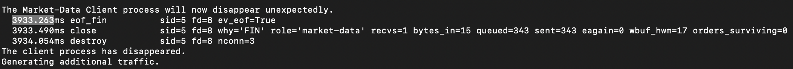
*Screenshot 8a — the server's own trace at the moment of the kill: `eof_fin`
for sid 5, then `close{why='FIN', role='market-data', queued=343, sent=343,
orders_surviving=0}` — nothing it was owed got truncated.*

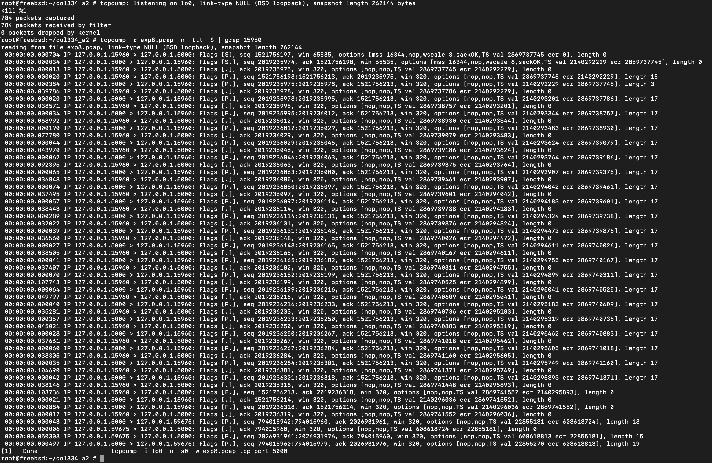
*Screenshot 8b — `exp8.pcap` filtered to port 15960 (the killed client, per
the `accept sid=5 ... peer='127.0.0.1:15960'` line): a normal four-way FIN
close, indistinguishable from an orderly disconnect.*

```
3933.263ms eof_fin sid=5 fd=8 ev_eof=True
3933.490ms close   sid=5 fd=8 why='FIN' role='market-data' recvs=1 bytes_in=15
                   queued=343 sent=343 eagain=0 wbuf_hwm=17 orders_surviving=0
3934.054ms destroy sid=5 fd=8 nconn=3
```

```
15960 > 5000: Flags [.]   ack ...        <- last ACK of a TRADE push
15960 > 5000: Flags [F.]  seq ...        <- the SIGKILL'd process's FIN
5000 > 15960: Flags [.]   ack ...           server ACKs
5000 > 15960: Flags [F.]  seq ...           server's own FIN
15960 > 5000: Flags [.]   ack ...           client ACKs -- full four-way close
```

**Table T10**

| time | event | wire | server observation | server action |
|---|---|---|---|---|
| 3933.263 ms | client `SIGKILL`ed | `[F.]` from 15960 | `eof_fin{ev_eof=True}` | mark dead |
| +0.23 ms | — | `[.]` then `[F.]` from server | `close{orders_surviving=0}` | teardown |
| +0.56 ms | — | client `[.]` | `destroy{nconn=3}` | reap fd |
| through 8314 ms | trading continues | `TRADE` pushes to sid 2 | — | unaffected |

This is byte-for-byte the same shape as Experiment 6 Part A's orderly close —
which is the point.

**Why no `EPIPE`.** The roadmap anticipated a possible FIN → data → RST → EPIPE
sequence. It did not occur, and the trace explains why: detection via
`kevent()` readiness beat any further write attempt, so the server never
tried to `send()` to a dead peer. Reaching `EPIPE` requires a write already in
flight at the instant of death — a timing race this workload does not hit.

**A gap in the harness we filled ourselves (T11).** Experiment 8 kills a
*Market-Data* client, which owns no orders — so it never exercises the
order-survival requirement. We wrote the missing test: a trader logs in, rests
`BUY JNST 100 238`, disconnects; a second trader then sells into it.

```
162192.955ms close sid=2 why='FIN' role='trader' orders_surviving=1
167024.123ms notify_dropped target_sid=2 msg=b'BOUGHT JNST 60 238\n'
```

Client-side: the surviving seller received `SOLD JNST 60 238`, the subscribed
Market-Data client received `TRADE JNST 60 238`, and only the departed buyer's
private `BOUGHT` was dropped. **The trade executed; the order outlived its
connection.**

**An asymmetry worth naming.** A departing *subscriber* is removed from
`subs[instrument]` at close time, so later broadcasts simply never iterate
over it — no dropped notification is logged. A departing *trader's resting
order* is deliberately left in the book, so a later match does still attempt
the notification and does produce a logged `notify_dropped`. Subscription
cleanup is immediate and silent; order survival is deliberate and observable.

---

## 10. Additional observations

### 10.1 Coalescing — the reverse of Experiment 3

Experiment 3 shows one message arriving as four segments. The complement also
holds: in a supplementary run, a trader's `LOGIN` plus three `SELL` lines
arrived in a **single** segment and were separated only by the framer.

```
recv sid=1 fd=6 n=67 rbuf_before=0 rbuf_after=0 lines_out=4
recv sid=2 fd=6 n=31 rbuf_before=0 rbuf_after=0 lines_out=2
```

Together, these bracket the byte-stream property from both sides: application
message boundaries and TCP segment boundaries are independent in *both*
directions.

**A prediction of ours that was wrong.** We expected the server's *outbound*
replies (`ORDER_ACCEPTED` + 3×`BOUGHT`) to coalesce into one segment. They do
not — `tcpdump -A` shows three separate 19-byte segments. The trace explains
it: `pending` reads 17, 19, 19, 19 and never accumulates, because
`queue_out()` flushes after every message and `TCP_NODELAY` prevents Nagle
from re-merging them. Outbound coalescing *does* occur, but only under
backpressure, which is precisely what Run E's `wbuf_hwm = 1,474` is. The
behaviour is the right one: per-message flush minimises latency while the peer
keeps up, and batches automatically when it does not.

### 10.2 errno reference (T12)

| errno | name | status | evidence, or why not |
|---|---|---|---|
| **35** | `EAGAIN`/`EWOULDBLOCK` | observed | Run E: 66 `send_would_block` events, `eagain=66` at close. Raised as `BlockingIOError`, caught in `flush()`, answered by arming `KQ_FILTER_WRITE`. |
| **54** | `ECONNRESET` | observed, abundantly | Every experiment — the harness's `SO_LINGER{1,0}` readiness probe yields `eof_rst errno=54 ev_fflags=54`; Experiment 6 Part B is the deliberate case. |
| **32** | `EPIPE` | not observed | Requires a write in flight at the instant of peer death; `kevent()`-driven detection pre-empts it (§9). Python ignores `SIGPIPE`, so it would surface as `BrokenPipeError`, which `flush()` already handles. |
| **60** | `ETIMEDOUT` | not observed | Requires a retransmission timeout — a peer that stops responding without RST. Impossible on `lo0`, which has no loss and no path to lose a peer silently. |

### 10.3 Market-Data client commands, completed

§2.8 lists `SUBSCRIBE`, `UNSUBSCRIBE` and `QUIT` as valid Market-Data Client
messages, but the original client only ever read its socket — it could send
none of them after the initial connect-time `SUBSCRIBE`s. `market_data.py`
now multiplexes stdin alongside the socket with the same `select.kqueue()`
pattern `trader.py` already used, so `UNSUBSCRIBE <instr>` and `QUIT` can be
typed live. Server-side support for both was already correct and unused;
this closed the client-side gap. Verified offline: `SUBSCRIBE`+`UNSUBSCRIBE`
round-trips two `OK`s and removes the session id from `engine.subs`;
`SUBSCRIBE`+`QUIT` acknowledges first and then closes, per §2.8.

### 10.4 Measurement methodology

Instruments split into two classes, and only one class is timing-sensitive:

- **Live** — `netstat`, `sockstat`, `ps -o wchan`, `getsockopt`, `FIONREAD`.
  These must be sampled *during* a run, and all of ours were.
- **Frozen** — `.pcap` files, the JSONL trace, console logs. `tcpdump -r`
  reads a file, so re-reading later is a pure function of its contents; this
  also makes the analysis reproducible by anyone holding the same capture.

Run E's capture reported `5252898 captured / 5252898 received by filter /
0 dropped by kernel`, so no packets were missed.

One reduction bug is worth recording because a figure exposed it: our first
plot of P1 sampled the *last* `pending` value per time bucket, but `pending`
is traced after the append and before the flush, so in the unblocked case it
is merely the message size — which averaged the backpressure spike away
entirely. Carrying a per-bucket maximum fixed it. The instrumentation was
correct; the reduction was not.

---

## 11. Reproducing this work

```
src/server.py          the Exchange Server (the only server file importing socket)
src/framing.py         newline framing        — no socket import
src/protocol.py        parsing and validation — no socket import
src/engine.py          order book and matching — no socket import
src/trader.py          Trader Client (kqueue-multiplexed stdin + socket)
src/market_data.py     Market-Data Client
tests/test_all.py      29 offline tests, including the fragmentation proofs
```

Instrumentation is enabled by environment variable, since the harness fixes
`argv`:

```sh
EXCH_TRACE=<path>      structured JSONL trace, used for the figures
EXCH_SNDBUF=<bytes>    SO_SNDBUF on accepted sockets (Experiment 7 control)
EXCH_WBUF_MAX=<bytes>  slow-consumer backlog cap (default 4 MiB)
EXCH_NAIVE=1           launch the blocking control server (Experiment 4 only)
```

Non-submission analysis tools live in `src/tools/`:
`exp7_load.py` (volume generator), `exp7_report.py` (trace reducer),
`exp7_probe.py` and `sb_probe.py` (the isolation diagnostics),
`exp7_csv.py` + `plot.py` (figures), `verify_quit.py` (§2.2.5 offline proof),
`gapd_concurrency.sh` (§4.3's ≥10-client / ≥2-trader / ≥4-MD requirement).
